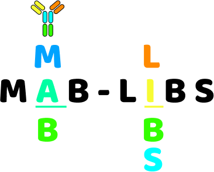

# mab-libs

  

Generating libraries of sequence variants is a common approach in early stage antibody screening.
These libraries are usually generated by randomizing the complementarity determining regions of the antibody variable domain.
It is a good idea to remove potential sequence liabilities from these gene before they are sent to a commercial supplier for synthesis. 
with mab-libs, you can generate these libraries in silico according to a prespecified recipe and scan them for potential liabilities.
